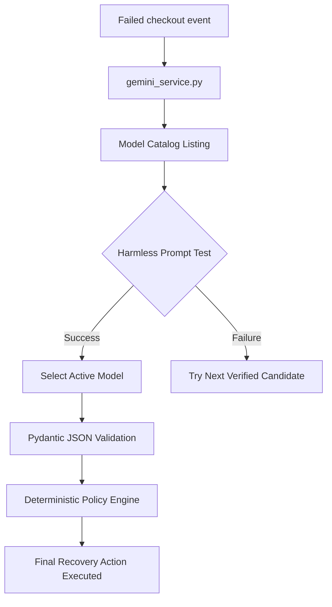

# Gemini AI Integration & Model Setup

RecoverAI uses the official `google-genai` Python SDK to analyze failed sandbox transactions and recommend optimal recovery actions. It features automated model discovery, manual selection, and automatic failover handling.

---

## 1. Environment Configuration

Define the following parameters in your backend environment file (`backend/.env`):

```bash
# Required: Your Google AI Studio / Gemini API Key
GEMINI_API_KEY=AIzaSy...

# Optional: Preferred model name. If blank or unsupported, 
# RecoverAI will auto-select the best discovered candidate.
GEMINI_MODEL=gemini-3.6-flash
```

> [!CAUTION]
> **API Key Security**: Never hardcode the `GEMINI_API_KEY` inside client-side code, print it in logs, or commit it to version control. The React frontend interacts only with local backend AI routing endpoints.

---

## 2. Technical Architecture



---

## 3. Key Engine Components

### A. Model Discovery
The engine calls `client.models.list()` to fetch the active account's model list, applying keyword filters to isolate text-generation models while excluding speech, robotics, live-stream, and embedding models.

### B. Compatibility Checks & Selectors
Before a model is allowed to run, the backend runs a harmless connection test checking structured JSON output capabilities. Only successfully verified models can be selected as the `active_model`.

### C. Automatic Failover
If the primary active model hits a `404 NOT_FOUND` or temporary server exception, the service catches the exception and immediately falls back to iterate through the list of other verified models (e.g. falling back from `gemini-3.6-flash` to `gemini-3.5-flash`), guaranteeing zero checkout analysis downtime.

---

## 4. REST Routing Endpoints

- **`GET /api/ai/gemini/status`**: Returns health checks showing the active model, SDK package, connection state, and last verification timestamp.
- **`GET /api/ai/models`**: Lists all filtered text models matching your API key and their validation flags.
- **`POST /api/ai/models/verify`**: Runs a compatibility check on a candidate model name.
- **`POST /api/ai/models/select`**: Activates a verified model.
