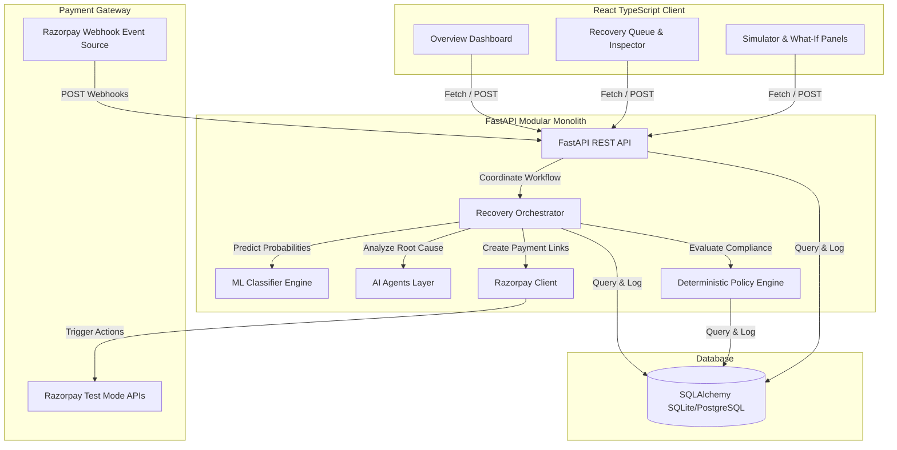
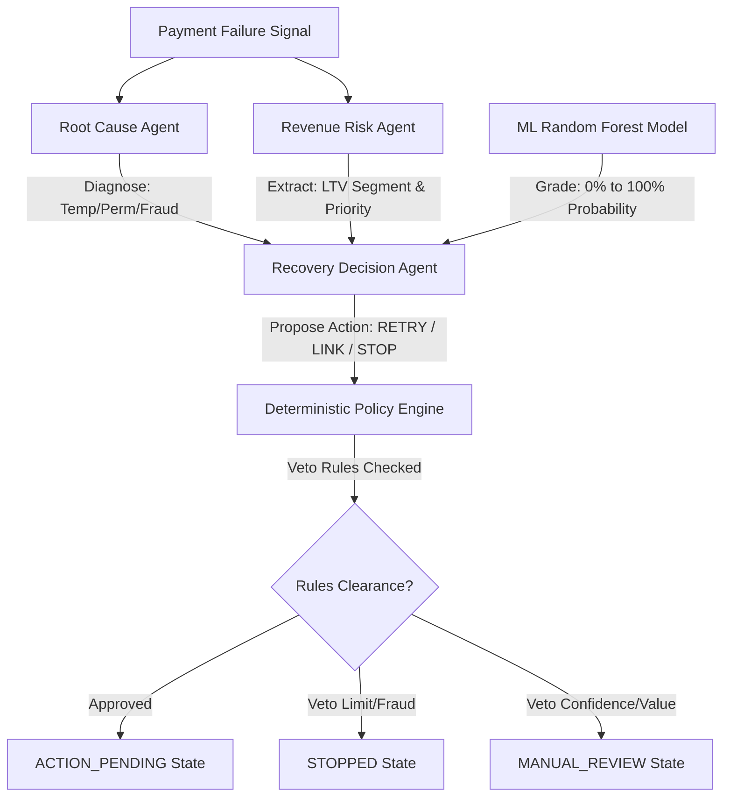
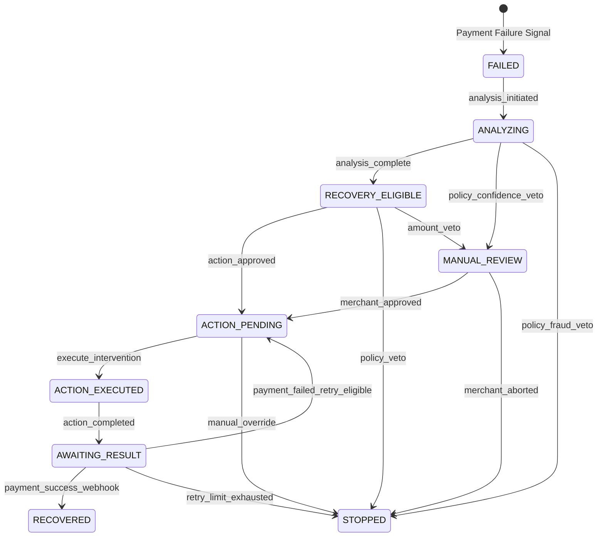
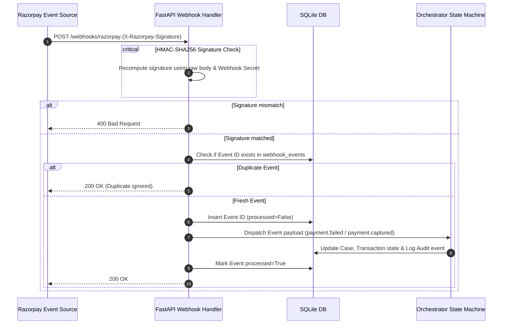

# RecoverAI Architecture Documentation

This document describes the system architecture, data models, AI workflow, state transitions, and webhook integrations of the **RecoverAI** platform.

---

## 1. System Topology

The diagram below outlines the overall component design of RecoverAI:

---

## 2. AI Decision Pipeline

Every failed checkout follows this evaluation pipeline:

---

## 3. Recovery State Machine

The state machine manages the lifecycle of a recovery case with strict transition validations:

---

## 4. Webhook and Idempotency Flow

This flow protects the system against duplicate processing and out-of-order events:

